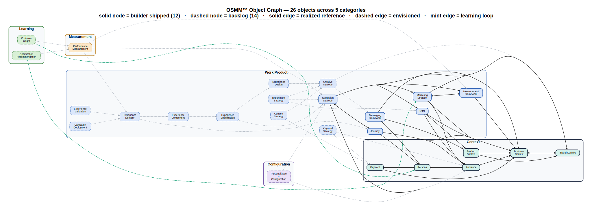
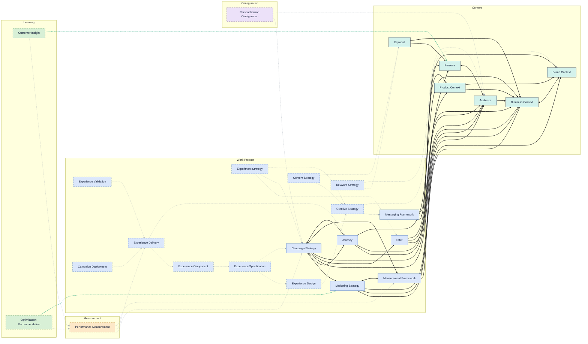

# OSMM™ Object Graph

A graph-database view of the OSMM object model — all **26 objects**
(12 with shipped builders, 14 in the backlog) across the 5 categories,
and the reference edges between them.

> **This file is generated** by [`scripts/gen_object_graph.py`](scripts/gen_object_graph.py).
> Edit the object/edge tables in that script and regenerate — do not hand-edit below.

## How to read it

- **Node fill** = category: Context, Work Product, Configuration, Measurement, Learning.
- **Solid node** = builder shipped (12); **dashed node** = backlog (14).
- **Solid edge** = a *realized* reference (a reference field defined in a shipped
  builder; mirrors the established table in [`RELATIONSHIPS.md`](RELATIONSHIPS.md)).
- **Dashed gray edge** = an *envisioned* reference — illustrative, not yet defined in a
  builder; it becomes solid when that builder ships and declares the field.
- **Mint edge** = the **learning loop** (Learning objects propose updates back into
  durable Context / Strategy — sub-process 7.7).

Context sits as the high-read foundation that everything references; Work Products flow
into Configuration → Delivery → Measurement; Learning closes the loop.

## Full view (SVG)

## Inline view (Mermaid)

