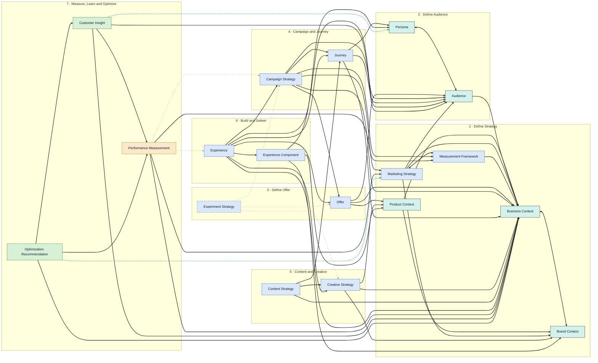

# OSMM™ Object Graph

A graph-database view of the OSMM object model — all **18 objects**
(17 with shipped builders, 1 in the backlog), laid out **left → right by
workflow phase (1 → 7)**, matching the [TAXONOMY](TAXONOMY.md) flow, with the reference
edges between them.

> **This file is generated** by [`scripts/gen_object_graph.py`](scripts/gen_object_graph.py).
> Edit the object/edge tables in that script and regenerate — do not hand-edit below.

## How to read it

- **Left → right = workflow phase** (Phase 1 Define Strategy … Phase 7 Measure, Learn &
  Optimize). Each labeled column is one phase.
- **Node color = category** (Context, Work Product, Configuration, Measurement, Learning) —
  a secondary cue, not the grouping axis.
- **Solid node** = builder shipped (17); **dashed node** = backlog (1).
- **Solid edge** = a *realized* reference (a reference field defined in a shipped builder;
  mirrors the established table in [`RELATIONSHIPS.md`](RELATIONSHIPS.md)).
- **Dashed gray edge** = an *envisioned* reference — illustrative, not yet defined in a
  builder; it becomes solid when that builder ships and declares the field.
- **Mint edge** = the **learning loop** (Phase 7 Learning objects propose updates back into
  the durable Phase 1–2 Context — sub-process 7.7).

Most reference edges point **right → left** (a later-phase Work Product references the
earlier-phase Context it depends on); the mint learning-loop edges close the cycle from
Phase 7 back to Phase 1.

## Full view (SVG)

## Inline view (Mermaid)

