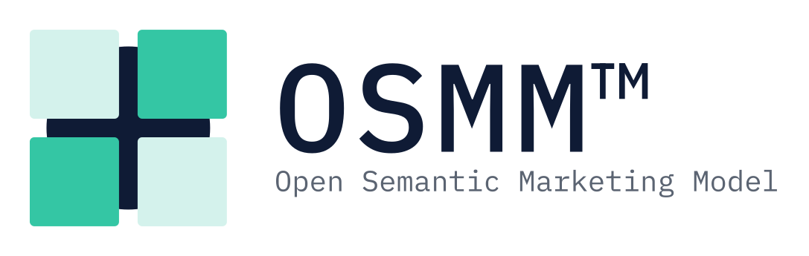

<picture>
  <source media="(prefers-color-scheme: dark)" srcset="brand/osmm-primary-horizontal-reversed.svg">
  
</picture>

# Open Semantic Marketing Model™

**An open interoperability standard for the decision work of marketing.**

OSMM defines canonical, machine-readable objects — and the relationships
between them — for the parts of marketing that have always lived in documents:
brand context, personas, audiences, creative and campaign strategy, journeys,
measurement, and the learning that flows back into all of it. It is not a
platform, a taxonomy, or a vendor framework. It is the shared structure that
lets people, tools, and AI agents operate against a common definition of the
work.

---

## Get started

OSMM ships as a Claude plugin, installed from this repository. Installing it
takes a minute — the exact steps depend on your product:

- **Claude Cowork (the app):** open **Customize → Plugins**, and under **Personal
  plugins** click **+ → Add marketplace**, enter
  `open-semantic-marketing-model/osmm`, then install the **osmm** plugin.
- **Claude Code (the CLI):** run two commands —

  ```
  /plugin marketplace add open-semantic-marketing-model/osmm
  /plugin install osmm@osmm
  ```

Either way you get all 18 builder skills. Hand one a real asset — a persona deck,
an About page, a campaign brief — and it returns a canonical OSMM object.

New to OSMM? Read **[`GETTING-STARTED.md`](GETTING-STARTED.md)** — a practical,
non-technical guide for marketers. For the full install, update, and release
details (including team-wide rollout), see [`PLUGIN.md`](PLUGIN.md).

## Why this exists

Three decades and billions of dollars into MarTech, the *decision* work of
marketing still runs on slide decks, spreadsheets, and PDFs. Briefs live in
Word, personas in decks, audiences in Excel, journeys in Miro. There is no
shared structure to any of it, so every handoff between teams or tools happens
in meetings and inboxes rather than in systems.

That was an inefficiency tax in a pre-AI world. As organizations move to
automate the decision work itself, it becomes the constraint: LLMs and agents
need structured context to be reliable, and they cannot scale on free-text
briefs and strategy decks. OSMM gives that work a structure to compose against.

A structured object is also far cheaper to reason over than its source
artifact — roughly a 5× reduction in tokens versus the source text it distills,
and far more versus a rendered deck. We frame this honestly as *distillation,
not lossless compression*: the canonical JSON is the interoperability contract,
and richer source assets are referenced, not replaced.

## How it works

Every object is a typed JSON document with stable references to other objects,
so an agent can resolve a campaign to its audience, its offer, its creative,
and its measurement framework without bespoke integration code. How those
references work — ids, reference fields, and the object graph — is specified in
[`RELATIONSHIPS.md`](RELATIONSHIPS.md).

```json
{
  "object_type": "persona",
  "version": "1.0",
  "persona_id": "PER-example",
  "persona_type": "consumer",
  "representative_quote": "I want to know exactly what I'm getting.",
  "triggers": ["...", "..."],
  "demographics": { "...": "..." }
}
```

The model is deliberately **lean over over-engineered** — minimal cores with
optional extensions — and grounded in real assets rather than invented
examples.

## The object model

OSMM currently spans **18 objects** across **7 workflow phases**, grouped into
**5 categories** by their read/write and governance profile:

| Category | Purpose |
|----------|---------|
| **Context** | Durable, reusable business intelligence (Business Context, Brand Context, Product Context, Audience, Persona). High-read, low-write. |
| **Work Product** | The structured outputs of decisions that today live in documents (Marketing Strategy, Creative Strategy, Campaign Strategy, Journey, …). |
| **Configuration** | Operational orchestration logic. *(Currently empty — its members folded into the Journey's `delivery_logic` and the Experience's `personalization_rules`.)* |
| **Measurement** | Performance data structured for analysis. Append-only. |
| **Learning** | Durable insight that updates the Context layer — the loop that makes the model compound rather than reset. |

Each builder is a skill named `osmm-<object-slug>-builder`; the full registry
and naming convention live in [`CONVENTION.md`](CONVENTION.md). For a visual,
whole-model **graph view** of all objects and their reference edges, see
[`GRAPH.md`](GRAPH.md).

## Repository structure

```
osmm/
├── .claude-plugin/  # plugin + marketplace manifests (install via /plugin)
├── schemas/        # canonical JSON Schema per object (schemas/<object_type>.schema.json)
├── examples/       # validated example instances grounded in real assets
├── skills/          # builder skills (osmm-<object>-builder); each references its object's schema
├── scripts/         # validate.py — checks every example against its schema (run in CI)
├── brand/           # logo, color tokens, usage — see brand/LOGO.md
├── roadmap/         # backlog (Kanban) + sequenced roadmap — the live build board
├── TAXONOMY.md      # workflow phases → objects (the phase view)
├── CONVENTION.md    # object registry + skill naming convention
├── RELATIONSHIPS.md # the object reference model (the graph view)
├── GOVERNANCE.md    # maintainer-led decision model + versioning policy
├── CONTRIBUTING.md  # how to propose objects and changes
├── CHANGELOG.md     # notable changes to the standard
├── GETTING-STARTED.md # non-technical guide for marketers — start here
├── PLUGIN.md        # install, update, and plugin release process
└── README.md
```

Each object's contract is a standalone **JSON Schema** in
[`schemas/`](schemas) — the single source of truth for its shape. The builder
skill references it (rather than embedding a parallel spec), and every instance
in `examples/` is validated against it in CI, so the schemas and examples can't
drift. Schemas are added per object as their builder ships; see
[`CONVENTION.md`](CONVENTION.md) → "Where the schema lives".

## Status

Early and active — **draft v0.1**. The standard is built iteratively: ship a
concrete, validated artifact, then refine. **17 of the 18 object builders have
shipped** (plus one artifact composer, `osmm-creative-brief-composer`). The
durable **Context foundation is complete** — all five Context builders are live
(`osmm-business-context-builder`, `osmm-brand-context-builder`,
`osmm-product-context-builder`, `osmm-persona-builder`, `osmm-audience-builder`) —
alongside the Phase 1 Work Products (Marketing Strategy, Measurement Framework), the
Phase 3–4 activation layer (Offer, Campaign Strategy, Journey), the Phase 5 creative
layer (Creative Strategy, Content Strategy), the Phase 6 build/deliver layer
(Experience, Experience Component), and the Phase 7 measure/learn/optimize layer that
closes the loop (Performance Measurement, Customer Insight, Optimization Recommendation).
Only the parked Experiment Strategy object remains unbuilt.
The live
build board is [`roadmap/BACKLOG.md`](roadmap/BACKLOG.md). Schemas evolve under strict
semantic versioning with formal deprecation, never silent breaks; the policy is
in [`GOVERNANCE.md`](GOVERNANCE.md).

## Relationship to OSI

OSMM is complementary to the [Open Semantic Interchange](https://open-semantic-interchange.org)
(OSI), not competitive. OSI operates at the BI/metrics layer; OSMM is the
marketing-decision layer that sits above it. Think of OSMM as the
decision-object companion to OSI's metrics objects.

## Governance & contributing

OSMM was created by **Rudolph Chang** and is stewarded by Design of Work
Partners LLC. It is **maintainer-led, not consensus-driven** — open standards
fragment when consensus becomes the goal. The community submits pull requests and
proposed objects; a small, opinionated maintainer core of operators reviews and
approves changes. See [`GOVERNANCE.md`](GOVERNANCE.md),
[`MAINTAINERS.md`](MAINTAINERS.md), and [`CONTRIBUTING.md`](CONTRIBUTING.md).

## License

OSMM is dual-licensed: **Apache 2.0** for schemas, scripts, and skills
([`LICENSE`](LICENSE)); **CC BY 4.0** for documentation and examples
([`LICENSE-docs`](LICENSE-docs)). The OSMM name and logo are trademarks of
Design of Work Partners LLC, governed by [`TRADEMARK.md`](TRADEMARK.md) and
**not** open-licensed. The authoritative per-path mapping is in
[`LICENSING.md`](LICENSING.md); copyright and attribution are in
[`NOTICE`](NOTICE).

Copyright © 2026 Design of Work Partners LLC.

## Brand

Logo files, color tokens, and usage rules are in
[`brand/LOGO.md`](brand/LOGO.md). The wordmark is set in IBM Plex Mono (SIL OFL 1.1).
The OSMM name and logo are trademarks of Design of Work Partners LLC; permitted
use is described in [`TRADEMARK.md`](TRADEMARK.md).
