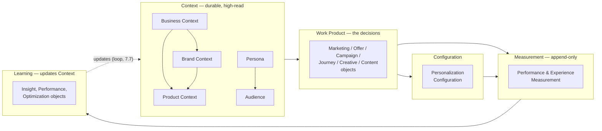

# OSMM™ Object Relationships

**Open Semantic Marketing Model — the reference model**
Status: Draft v0.1

OSMM's core promise is that every object is *typed and addressable*, with stable
references to other objects, so an agent can resolve a campaign to its audience,
its offer, its creative, and its measurement framework without bespoke
integration code ([README](README.md)). This document defines **how those
references work** and **what the reference graph looks like** — the layer that
turns 18 standalone objects into a connected model.

It complements the other three docs:

- [TAXONOMY.md](TAXONOMY.md) — *which* object each workflow sub-process resolves
  to (the phase view).
- [CONVENTION.md](CONVENTION.md) — how builder skills, instance files, and slugs
  are named.
- This document — how objects *point at each other* (the graph view).
- [GRAPH.md](GRAPH.md) — a rendered, whole-model **graph-database view** (all 27
  objects + their edges, built and backlog), generated from this document's
  reference data via [`scripts/gen_object_graph.py`](scripts/gen_object_graph.py).

---

## The reference mechanism

Three rules make objects composable:

1. **Every object has a stable, human-readable id.** The id lives in a typed
   field on the object (`persona_id`, `business_id`, …) and is prefixed by an
   object-type code (`PER-`, `BIZ-`, …). Once assigned it never changes; on
   revision you bump `version`, not the id. Other objects depend on this
   stability.

2. **References are ids, not embedded copies.** When one object relates to
   another, it stores the *id* of the target in a reference field — never a
   duplicated copy of the target's data. This is what keeps the model a graph
   rather than a pile of nested documents, and it's what makes a single object
   roughly 5× cheaper to reason over than its source artifact.

3. **Forward references use a placeholder id.** Objects are often built before
   the things they point at exist. A reference to a not-yet-built object uses a
   placeholder of the form `<PREFIX>-PLACEHOLDER-<slug>` (e.g.
   `AUD-PLACEHOLDER-wendys-deal-savvy-craver`). The placeholder is replaced with the
   real id once the target object is built. This lets Context objects ship
   without blocking on their dependencies.

### Field naming for references

- A **single** reference is a scalar id field, named for what it points at:
  `linked_brand_context`.
- A **multiple** reference is an array of ids, named in the plural:
  `linked_audiences`.

Reference fields are defined on the object that *holds* the reference, in that
object's builder `SKILL.md`. A field is added only where the link does real work
downstream (per the "lean over over-engineered" tenet in
[GOVERNANCE.md](GOVERNANCE.md#design-tenets)) — objects are not cross-linked just
because a relationship is conceivable.

## Object id prefixes

The id prefix is a short, uppercase code derived from the object name. It makes
an id self-describing (you can tell `PER-wendys-deal-savvy-craver` is a Persona without
a lookup) and namespaces ids so they stay unique across a portfolio.

**Established prefixes** (in use by shipped builders):

| Object | Prefix | Id field | Example |
|--------|--------|----------|---------|
| Business Context | `BIZ-` | `business_id` | `BIZ-ibm` |
| Brand Context | `BRC-` | `brand_context_id` | `BRC-ibm` |
| Product Context | `PRD-` | `product_id` | `PRD-ibm-watsonx` |
| Persona | `PER-` | `persona_id` | `PER-wendys-deal-savvy-craver` |
| Audience | `AUD-` | `audience_id` | `AUD-wendys-value-seekers` |
| Marketing Strategy | `MKS-` | `marketing_strategy_id` | `MKS-ibm-2026` |
| Measurement Framework | `MEF-` | `measurement_framework_id` | `MEF-ibm-2026` |
| Offer | `OFR-` | `offer_id` | `OFR-wendys-biggie-bag` |
| Campaign Strategy | `CMS-` | `campaign_strategy_id` | `CMS-wendys-biggie-bag` |
| Journey | `JNY-` | `journey_id` | `JNY-wendys-app-habit` |
| Creative Strategy | `CRS-` | `creative_strategy_id` | `CRS-ibm-watsonx` |
| Content Strategy | `CTS-` | `content_strategy_id` | `CTS-ibm-watsonx` |
| Experience | `EXP-` | `experience_id` | `EXP-wendys-baconator-winback-email` |
| Experience Component | `EXC-` | `experience_component_id` | `EXC-wendys-baconator-cta` |

> Fourteen prefixes are owned by shipped builders — the five Context builders
> (`osmm-business-context-builder`, `osmm-brand-context-builder`,
> `osmm-product-context-builder`, `osmm-persona-builder`, `osmm-audience-builder`)
> plus nine Work Product builders: `osmm-marketing-strategy-builder`,
> `osmm-measurement-framework-builder`, `osmm-offer-builder`,
> `osmm-campaign-strategy-builder`, `osmm-journey-builder`,
> `osmm-creative-strategy-builder`, `osmm-content-strategy-builder`,
> `osmm-experience-builder`, and `osmm-experience-component-builder`.

**Assigning new prefixes.** Every object gets a prefix when its builder is
authored. Prefixes are assigned by maintainers (like controlled vocabularies,
they are part of the standard, not invented per-project) and recorded in the
table below as each object is built. The convention: a short uppercase code,
unique across the model, derived from the object name — preferring a recognizable
3-letter form. A proposed starter set for the remaining objects lives in the
[appendix](#appendix-proposed-prefixes); it is **not yet ratified** and should
be confirmed object-by-object as builders land.

## The reference graph

At the category level, references flow in a loop that mirrors the workflow but is
*not* limited to adjacent phases — any Work Product can reference any Context
object it depends on.

Reading the graph:

- **Context is the foundation.** Work Products reference Context; Context does
  not reference Work Products. This is what makes Context "high-read, low-write"
  and reusable across many campaigns.
- **Within Context, a few links exist:** Business Context ↔ Brand Context;
  Product Context → its Business Context (and optionally the Brand Context it is
  marketed under); Persona ↔ Audience (a persona brings an audience to life).
- **"Segment" is the Audience Object, not a separate node.** OSMM models the
  addressable segment as the Audience Object (its `segmentation_basis` field
  records the lens); a Persona *describes* a member while an Audience *selects*
  the group. A distinct Segment object would only be warranted if OSMM later
  needs to model activation separately (one segment synced as many platform
  audiences) — an edge/delivery concern, not a Context one.
- **Measurement references what it measures** (the Work Products and
  Configurations that ran), and is append-only.
- **Learning closes the loop.** Learning objects reference the objects they
  evaluate and *propose updates back into Context* — sub-process 7.7 in
  [TAXONOMY.md](TAXONOMY.md). This is the mechanism that makes the model compound
  rather than reset: a Customer Insight proposes an update to a Persona; an
  Optimization Recommendation feeds Marketing Strategy.

## Established reference fields

These are the concrete, shipped reference edges. The table grows as each builder
is authored — a new builder's `SKILL.md` is the source of truth for the
reference fields it introduces.

| From object | Field | Cardinality | To object | Notes |
|-------------|-------|-------------|-----------|-------|
| Business Context | `linked_brand_context` | one | Brand Context | `BRC-PLACEHOLDER-<slug>` until the Brand Context is built. |
| Brand Context | `linked_business_context` | one | Business Context | `BIZ-PLACEHOLDER-<slug>` until the Business Context is built. Inverse of the edge above. |
| Product Context | `linked_business_context` | one | Business Context | The business that offers it. `BIZ-PLACEHOLDER-<slug>` until built. |
| Product Context | `linked_brand_context` | one (optional) | Brand Context | The brand it is marketed under. `BRC-PLACEHOLDER-<slug>` until built; omit if not relevant. |
| Product Context | `related_offerings` | many (optional) | Product Context | Complementary, parent, or bundled offerings. `PRD-PLACEHOLDER-<slug>` until built. |
| Persona | `linked_audiences` | many | Audience | `AUD-PLACEHOLDER-<slug>` until the Audience is built. |
| Audience | `linked_business_context` | one | Business Context | `BIZ-PLACEHOLDER-<slug>` until built. |
| Audience | `linked_personas` | many | Persona | `PER-PLACEHOLDER-<slug>` until built. Inverse of Persona → Audience. |
| Marketing Strategy | `linked_business_context` | one | Business Context | The first **Work Product → Context** edge. `BIZ-PLACEHOLDER-<slug>` until built. |
| Marketing Strategy | `linked_brand_context` | one (optional) | Brand Context | `BRC-PLACEHOLDER-<slug>` until built; omit if not relevant. |
| Marketing Strategy | `priority_audiences` | many (optional) | Audience | `AUD-PLACEHOLDER-<slug>` until built. Prioritizes existing Audiences; does not restate them. |
| Marketing Strategy | `linked_measurement_framework` | one (optional) | Measurement Framework | Realized — resolves to the paired `MEF-<slug>`. Bidirectional with the framework's `linked_marketing_strategy`. |
| Measurement Framework | `linked_business_context` | one | Business Context | `BIZ-PLACEHOLDER-<slug>` until built. |
| Measurement Framework | `linked_marketing_strategy` | one | Marketing Strategy | The first **bidirectional Work Product ↔ Work Product** edge — inverse of the strategy's `linked_measurement_framework`. `MKS-PLACEHOLDER-<slug>` until built. |
| Offer | `linked_product` | one (optional) | Product Context | The offering the offer promotes. `PRD-PLACEHOLDER-<slug>` until built. The first **Work Product → Product Context** edge. |
| Offer | `linked_audiences` | many (optional) | Audience | Who the offer is extended to. `AUD-PLACEHOLDER-<slug>` until built. |
| Offer | `linked_business_context` | one (optional) | Business Context | `BIZ-PLACEHOLDER-<slug>` until built. |
| Campaign Strategy | `linked_marketing_strategy` | one (optional) | Marketing Strategy | The strategy the campaign executes. `MKS-PLACEHOLDER-<slug>` until built. |
| Campaign Strategy | `linked_journey` | one (optional) | Journey | The journey the campaign uses (4.8 pairs them). `JNY-PLACEHOLDER-<slug>` until built. |
| Campaign Strategy | `audience_offer_mapping[]` | many | Audience + Offer | Each row pairs an `AUD-` with an `OFR-` (the 4.3 matrix). Placeholders until built. |
| Campaign Strategy | `linked_audiences` / `linked_offers` | many (optional) | Audience / Offer | The audiences activated and offers carried. Placeholders until built. |
| Campaign Strategy | `linked_business_context` | one (optional) | Business Context | `BIZ-PLACEHOLDER-<slug>` until built. |
| Campaign Strategy | `linked_measurement_framework` | one (optional) | Measurement Framework | Campaign-scope measurement (the framework's `scope` facet). `MEF-PLACEHOLDER-<slug>` until built. |
| Journey | `linked_campaign_strategy` | one (optional) | Campaign Strategy | The campaign it serves — omitted for always-on lifecycle journeys. `CMS-PLACEHOLDER-<slug>` until built. |
| Journey | `linked_audiences` | many (optional) | Audience | `AUD-PLACEHOLDER-<slug>` until built. |
| Journey | `linked_personas` | many (optional) | Persona | `PER-PLACEHOLDER-<slug>` until built. |
| Journey | `stages[].persona_tracks[].persona` | many | Persona | The **(persona × stage) cell** — per persona, the stage's `key_questions` (directional keywords) and `key_messages` (the cascaded message). `PER-PLACEHOLDER-<slug>` until built. |
| Journey | `linked_business_context` | one (optional) | Business Context | `BIZ-PLACEHOLDER-<slug>` until built. |
| Creative Strategy | `linked_brand_context` / `linked_product` / `linked_personas` / `linked_campaign_strategy` / `linked_business_context` | one / one / many / one / one (optional) | Brand Context / Product Context / Persona / Campaign Strategy / Business Context | Brand voice it operates within, offering (its `product_messaging` is the message source), personas, campaign, business. Placeholders until built. |
| Content Strategy | `linked_creative_strategy` / `linked_journey` / `linked_personas` / `linked_campaign_strategy` / `linked_business_context` | one / one / many / one / one (optional) | Creative Strategy / Journey / Persona / Campaign Strategy / Business Context | The creative direction it sits under, the journey it supports (whose `persona_tracks` carry the questions it answers), personas, campaign, business. Placeholders until built. |
| Experience | `linked_components` | many (optional) | Experience Component | The reusable building blocks it's assembled from (6.2). `EXC-PLACEHOLDER-<slug>` until built. |
| Experience | `personalization_rules[].audience` | many (optional) | Audience | Which audience gets which variant (the former Personalization Configuration). `AUD-PLACEHOLDER-<slug>` until built. |
| Experience | `linked_campaign_strategy` / `linked_journey` / `linked_audiences` / `linked_offer` / `linked_creative_strategy` / `linked_business_context` | one / one / many / one / one / one (optional) | Campaign Strategy / Journey / Audience / Offer / Creative Strategy / Business Context | The campaign it runs in, the journey/stage it serves, audiences, offer, creative direction, business. Placeholders until built. |
| Experience Component | `linked_brand_context` / `linked_product` / `linked_personas` | one / one / many (optional) | Brand Context / Product Context / Persona | The brand voice it follows, the offering, and who it's for. Placeholders until built. |

> Two bidirectional Context edges are realized (Business Context ↔ Brand Context,
> Persona ↔ Audience); the **first Work Product → Context edges** are live (a
> Marketing Strategy references its Business Context, Brand Context, and priority
> Audiences); and the **first bidirectional Work Product ↔ Work Product edge** is
> realized — Marketing Strategy ↔ Measurement Framework (the strategy's
> `MEF-PLACEHOLDER-*` is now resolved to the real framework id, bumping the
> strategy to `v1.1`). **Product Context → Business/Brand Context** is also live
> (the watsonx example resolves real `BIZ-ibm` and `BRC-ibm` ids). The **Phase 3–5
> activation/creative cluster** is live: **Offer → Product Context** (the first Work
> Product → Product Context edge), **Campaign Strategy → Marketing Strategy / Journey /
> Audience / Offer**, **Journey → Campaign Strategy / Audience / Persona** (and per-stage
> `persona_tracks` carrying each persona's questions and messages), and **Creative
> Strategy / Content Strategy → Brand/Product Context + Journey** — wiring strategy to
> activation to creative and content, with messaging cascading Brand → Product → Journey
> rather than living in a separate object. Inbound references implied by the model but not
> yet realized (e.g. a Customer Insight proposing Persona updates; an Experiment Strategy
> referencing the Offer/Campaign/Creative it tests) are defined when those builders are authored.

## Referential integrity

Because references are ids, integrity is checkable without a database:

- A reference resolves if some object in the set has a matching id.
- A `*-PLACEHOLDER-*` id is an explicit, *expected* dangling reference — a
  to-do, not an error.
- Resolving a placeholder is a deliberate edit (swap the placeholder for the
  real id) recorded by bumping the holding object's `version`.

A future `osmm-<object>-validator` skill (see the verb slots in
[CONVENTION.md](CONVENTION.md)) is the natural home for automated
reference-integrity checks; until then it is a review responsibility.

---

## Appendix: proposed prefixes

A starter prefix for every remaining object, for discussion only — **not
ratified.** Confirm each one when its builder is authored, then move the row up
into the established table. Listed in registry order
([CONVENTION.md](CONVENTION.md#full-builder-registry)).

| Object | Proposed prefix |
|--------|-----------------|
| Experiment Strategy | `XPR-` |
| Performance Measurement | `PFM-` |
| Customer Insight | `CIN-` |
| Optimization Recommendation | `OPR-` |

The earlier `Experience *` prefix clashes dissolved when the Phase 6 Experience-\*
family collapsed into a single **Experience** object (`EXP-`) in the v0.9 right-sizing;
only **Experience Component** (`EXC-`) remains alongside it, and both are now ratified.
