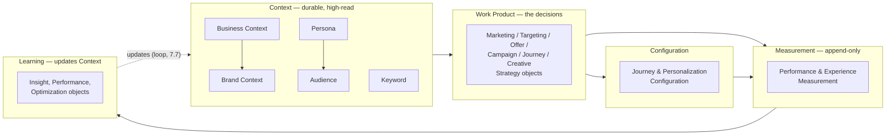

# OSMM™ Object Relationships

**Open Semantic Marketing Model — the reference model**
Status: Draft v0.1

OSMM's core promise is that every object is *typed and addressable*, with stable
references to other objects, so an agent can resolve a campaign to its audience,
its offer, its creative, and its measurement framework without bespoke
integration code ([README](README.md)). This document defines **how those
references work** and **what the reference graph looks like** — the layer that
turns 34 standalone objects into a connected model.

It complements the other three docs:

- [TAXONOMY.md](TAXONOMY.md) — *which* object each workflow sub-process resolves
  to (the phase view).
- [CONVENTION.md](CONVENTION.md) — how builder skills, instance files, and slugs
  are named.
- This document — how objects *point at each other* (the graph view).

---

## The reference mechanism

Three rules make objects composable:

1. **Every object has a stable, human-readable id.** The id lives in a typed
   field on the object (`persona_id`, `business_id`, …) and is prefixed by an
   object-type code (`PER-`, `BIZ-`, …). Once assigned it never changes; on
   revision you bump `version`, not the id. Other objects depend on this
   stability.

2. **References are ids, not embedded copies.** When one object relates to
   another, it stores the *id* of the target in a reference field — never a
   duplicated copy of the target's data. This is what keeps the model a graph
   rather than a pile of nested documents, and it's what makes a single object
   roughly 5× cheaper to reason over than its source artifact.

3. **Forward references use a placeholder id.** Objects are often built before
   the things they point at exist. A reference to a not-yet-built object uses a
   placeholder of the form `<PREFIX>-PLACEHOLDER-<slug>` (e.g.
   `AUD-PLACEHOLDER-wendys-deal-savvy-craver`). The placeholder is replaced with the
   real id once the target object is built. This lets Context objects ship
   without blocking on their dependencies.

### Field naming for references

- A **single** reference is a scalar id field, named for what it points at:
  `linked_brand_context`.
- A **multiple** reference is an array of ids, named in the plural:
  `linked_audiences`.

Reference fields are defined on the object that *holds* the reference, in that
object's builder `SKILL.md`. A field is added only where the link does real work
downstream (per the "lean over over-engineered" tenet in
[GOVERNANCE.md](GOVERNANCE.md#design-tenets)) — objects are not cross-linked just
because a relationship is conceivable.

## Object id prefixes

The id prefix is a short, uppercase code derived from the object name. It makes
an id self-describing (you can tell `PER-wendys-deal-savvy-craver` is a Persona without
a lookup) and namespaces ids so they stay unique across a portfolio.

**Established prefixes** (in use by shipped builders):

| Object | Prefix | Id field | Example |
|--------|--------|----------|---------|
| Business Context | `BIZ-` | `business_id` | `BIZ-ibm` |
| Brand Context | `BRC-` | `brand_context_id` | `BRC-ibm` |
| Persona | `PER-` | `persona_id` | `PER-wendys-deal-savvy-craver` |
| Audience | `AUD-` | `audience_id` | `AUD-wendys-value-seekers` |
| Marketing Strategy | `MKS-` | `marketing_strategy_id` | `MKS-ibm-2026` |

> Five prefixes are owned by shipped builders — the four Context builders
> (`osmm-business-context-builder`, `osmm-brand-context-builder`,
> `osmm-persona-builder`, `osmm-audience-builder`) plus the first Work Product
> builder, `osmm-marketing-strategy-builder`.

**Assigning new prefixes.** Every object gets a prefix when its builder is
authored. Prefixes are assigned by maintainers (like controlled vocabularies,
they are part of the standard, not invented per-project) and recorded in the
table below as each object is built. The convention: a short uppercase code,
unique across the model, derived from the object name — preferring a recognizable
3-letter form. A proposed starter set for the remaining objects lives in the
[appendix](#appendix-proposed-prefixes); it is **not yet ratified** and should
be confirmed object-by-object as builders land.

## The reference graph

At the category level, references flow in a loop that mirrors the workflow but is
*not* limited to adjacent phases — any Work Product can reference any Context
object it depends on.

Reading the graph:

- **Context is the foundation.** Work Products reference Context; Context does
  not reference Work Products. This is what makes Context "high-read, low-write"
  and reusable across many campaigns.
- **Within Context, a few links exist:** Business Context ↔ Brand Context;
  Persona ↔ Audience (a persona brings an audience to life); Keyword → the
  Personas that search a term.
- **"Segment" is the Audience Object, not a separate node.** OSMM models the
  addressable segment as the Audience Object (its `segmentation_basis` field
  records the lens); a Persona *describes* a member while an Audience *selects*
  the group. A distinct Segment object would only be warranted if OSMM later
  needs to model activation separately (one segment synced as many platform
  audiences) — an edge/delivery concern, not a Context one.
- **Measurement references what it measures** (the Work Products and
  Configurations that ran), and is append-only.
- **Learning closes the loop.** Learning objects reference the objects they
  evaluate and *propose updates back into Context* — sub-process 7.7 in
  [TAXONOMY.md](TAXONOMY.md). This is the mechanism that makes the model compound
  rather than reset: a Customer Insight proposes an update to a Persona; an
  Optimization Recommendation feeds Marketing Strategy.

## Established reference fields

These are the concrete, shipped reference edges. The table grows as each builder
is authored — a new builder's `SKILL.md` is the source of truth for the
reference fields it introduces.

| From object | Field | Cardinality | To object | Notes |
|-------------|-------|-------------|-----------|-------|
| Business Context | `linked_brand_context` | one | Brand Context | `BRC-PLACEHOLDER-<slug>` until the Brand Context is built. |
| Brand Context | `linked_business_context` | one | Business Context | `BIZ-PLACEHOLDER-<slug>` until the Business Context is built. Inverse of the edge above. |
| Persona | `linked_audiences` | many | Audience | `AUD-PLACEHOLDER-<slug>` until the Audience is built. |
| Audience | `linked_business_context` | one | Business Context | `BIZ-PLACEHOLDER-<slug>` until built. |
| Audience | `linked_personas` | many | Persona | `PER-PLACEHOLDER-<slug>` until built. Inverse of Persona → Audience. |
| Marketing Strategy | `linked_business_context` | one | Business Context | The first **Work Product → Context** edge. `BIZ-PLACEHOLDER-<slug>` until built. |
| Marketing Strategy | `linked_brand_context` | one (optional) | Brand Context | `BRC-PLACEHOLDER-<slug>` until built; omit if not relevant. |
| Marketing Strategy | `priority_audiences` | many (optional) | Audience | `AUD-PLACEHOLDER-<slug>` until built. Prioritizes existing Audiences; does not restate them. |
| Marketing Strategy | `linked_measurement_framework` | one (optional) | Measurement Framework | `MEF-PLACEHOLDER-<slug>` until the Measurement Framework builder (B04) ships. |

> Two bidirectional Context edges are realized (Business Context ↔ Brand Context,
> Persona ↔ Audience), and the **first Work Product → Context edges** are now live:
> a Marketing Strategy references its Business Context, Brand Context, and priority
> Audiences. The Marketing Strategy → Measurement Framework edge resolves once B04
> ships (it holds a `MEF-PLACEHOLDER-*` until then). Inbound references implied by
> the model but not yet realized (e.g. a Keyword linking the Personas that search
> it; a Customer Insight proposing Persona updates) are defined when those builders
> are authored.

## Referential integrity

Because references are ids, integrity is checkable without a database:

- A reference resolves if some object in the set has a matching id.
- A `*-PLACEHOLDER-*` id is an explicit, *expected* dangling reference — a
  to-do, not an error.
- Resolving a placeholder is a deliberate edit (swap the placeholder for the
  real id) recorded by bumping the holding object's `version`.

A future `osmm-<object>-validator` skill (see the verb slots in
[CONVENTION.md](CONVENTION.md)) is the natural home for automated
reference-integrity checks; until then it is a review responsibility.

---

## Appendix: proposed prefixes

A starter prefix for every remaining object, for discussion only — **not
ratified.** Confirm each one when its builder is authored, then move the row up
into the established table. Listed in registry order
([CONVENTION.md](CONVENTION.md#full-builder-registry)).

| Object | Proposed prefix |
|--------|-----------------|
| Keyword | `KW-` |
| Measurement Framework | `MEF-` |
| Targeting Strategy | `TGS-` |
| Keyword Strategy | `KWS-` |
| Offer Strategy | `OFS-` |
| Offer | `OFR-` |
| Offer Test Strategy | `OTS-` |
| Campaign Strategy | `CMS-` |
| Journey Strategy | `JNS-` |
| Campaign Measurement | `CMM-` |
| Messaging Framework | `MSF-` |
| Creative Strategy | `CRS-` |
| Content Strategy | `CTS-` |
| Experience Design | `EXD-` |
| Creative Test Strategy | `CTS2-` → resolve clash with Content Strategy |
| Experience Specification | `EXS-` |
| Experience Component | `EXC-` |
| Journey Configuration | `JNC-` |
| Personalization Configuration | `PZC-` |
| Experience Delivery | `EXV-` → resolve vs. Experience Validation |
| Experience Validation | `EXL-` |
| Campaign Deployment | `CMD-` |
| Experience Performance | `EXP-` |
| Performance Measurement | `PFM-` |
| Customer Insight | `CIN-` |
| Offer Performance | `OFP-` |
| Creative Performance | `CRP-` |
| Journey Performance | `JNP-` |
| Optimization Recommendation | `OPR-` |

The two flagged clashes (`Content Strategy`/`Creative Test Strategy`,
`Experience Delivery`/`Experience Validation`) are exactly why prefixes are
ratified deliberately rather than auto-generated: short codes collide, and the
model needs unique, stable ones.
