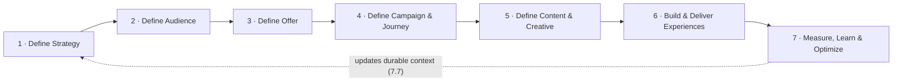

# OSMM™ Workflow Taxonomy

**Open Semantic Marketing Model — workflow classification**  
Status: Draft v0.1 · generated from the OSMM object model

This taxonomy is the classification layer that drives the standard: it maps the seven workflow **phases** to their **L2 sub-processes**, the **key decisions** each makes, and the canonical **OSMM object** each resolves to. Objects are the machine-readable source of truth; the *human-readable artifact* column is the rendered view a person reads (a brief, a summary, a deck) — the same object-vs-rendering split that runs through the rest of OSMM.

> **How to read a row:** an L2 sub-process makes one or more *key decisions*, and the result is written to (creates or updates) the named *output object*. The *artifact* is how that object is presented to people.

## The seven phases

## Phase 1. Define Strategy

**Theme** — What are we trying to achieve and why?  
**Primary goal** — Strategic direction  
**Key questions** — What business problem are we solving? What priorities matter?

| L2 sub-process | Key decisions | Resolves to object | Human-readable artifact |
|---|---|---|---|
| 1.1 Define Business Context | Industry classification, GTM model, competitive set, regulatory assumptions | Business Context Object | Business Context Summary |
| 1.2 Define Brand Context | Brand personality, tone principles, messaging guardrails | Brand Context Object | Brand Playbook, Voice Guide |
| 1.3 Define Product Context | Offering features, how it works, benefits, product-level messaging | Product Context Object | Product Brief, Solution Brief, Datasheet |
| 1.4 Define Business & Marketing Objectives | Business objectives, marketing objectives, success criteria | Marketing Strategy Object | Strategic Brief, Objective Framework |
| 1.5 Define Market & Competitive Strategy | Competitive positioning, differentiation strategy | Marketing Strategy Object | Competitive Strategy Summary |
| 1.6 Define Customer & Growth Priorities | Priority audiences, growth bets | Marketing Strategy Object | Growth Prioritization Framework |
| 1.7 Define Positioning & Value Proposition | Value proposition, positioning strategy | Marketing Strategy Object | Positioning Framework, Messaging Foundation |
| 1.8 Define Measurement Framework | KPI framework, success metrics | Measurement Framework Object | KPI Framework, Measurement Plan |
| 1.9 Confirm Strategic Direction | Final strategic direction | Marketing Strategy Object | Strategy Presentation, Executive Brief |

> **Product Context is the *offering*, not the company and not the offer.** Sub-process
> 1.3 resolves to the **Product Context Object** — the durable description of a product,
> service, or solution (its features, how it works, benefits, and product-level messaging).
> It is distinct from **Business Context** (the company; its `products_and_services` is a
> lightweight portfolio list, while Product Context structures each offering in depth — one
> business → many products) and from the **Offer Object** (Phase 3: the time-bound value
> exchange / call to action, e.g. a trial, demo, discount, or financing deal). An Offer
> *references* a Product Context; it does not restate it.

## Phase 2. Define Audience

**Theme** — Who matters most, what drives them, and how do they search?  
**Primary goal** — Customer understanding  
**Key questions** — Who should we target? Why? What behaviors matter? What do they search and ask?

| L2 sub-process | Key decisions | Resolves to object | Human-readable artifact |
|---|---|---|---|
| 2.1 Define Audience Strategy | Priority audiences, strategic segments | Marketing Strategy Object | Audience Strategy Summary |
| 2.2 Define Audience Segments | Segment definitions, inclusion criteria | Audience Object | Audience Definitions |
| 2.3 Define Audience Qualification Rules | Inclusion / exclusion logic | Audience Object | Audience Rules Summary |
| 2.4 Define Customer Needs & Behaviors | Priority behaviors, customer needs | Persona Object | Persona Profiles |
| 2.5 Define Personas | Persona definitions | Persona Object | Persona Profiles |
| 2.6 Define Lifecycle & Value Framework | Lifecycle framework, value segmentation | Audience Object | Lifecycle Framework |
| 2.7 Define Keyword & Topic Strategy | Priority keywords and topics, intent distribution, AEO targets, SEO targets, topic-to-journey mapping | Keyword Object, Keyword Strategy Object | Keyword & Topic Strategy |
| 2.8 Define Audience Prioritization | Target audience prioritization | Marketing Strategy Object | Prioritization Matrix |
| 2.9 Confirm Audience Definition | Final audience strategy | Marketing Strategy Object | Audience Summary |

> **"Segment" is the Audience Object — not a separate object.** Sub-process 2.2
> ("Define Audience Segments"), 2.3 (inclusion/exclusion logic), and 2.6
> (lifecycle & value segmentation) all resolve to the **Audience Object**, which
> is OSMM's addressable segment. The `segmentation_basis` field on the object
> records *which kind* of segment it is (demographic, behavioral, firmographic,
> value-based, lifecycle, etc.). A Persona *describes* the member; the Audience
> *selects* the group. Audience *prioritization* (2.1, 2.8, 2.9) is **part of the
> Marketing Strategy Object** — it names which Audiences matter and in what
> priority (`priority_audiences`, `growth_priorities`), so OSMM does not carry a
> separate Targeting Strategy object. (Consolidated in the v0.5 right-sizing — see
> the note under the resolution index.)

## Phase 3. Define Offer

**Theme** — What motivates action?  
**Primary goal** — Offer-market fit  
**Key questions** — What value exchange matters? Why will people act?

| L2 sub-process | Key decisions | Resolves to object | Human-readable artifact |
|---|---|---|---|
| 3.1 Define Desired Behavior Change | Behavior-change objective | Offer Object | Behavior Change Summary |
| 3.2 Define Offer Strategy | Offer strategy, incentive philosophy | Offer Object | Offer Strategy Summary |
| 3.3 Define Offer Architecture | Offer structure | Offer Object | Offer Framework |
| 3.4 Define Incentive & Economics | Incentive structure, profitability thresholds | Offer Object | Incentive Framework |
| 3.5 Define Offer Positioning | Positioning approach | Offer Object | Offer Positioning Summary |
| 3.6 Define Eligibility & Rules | Eligibility logic | Offer Object | Offer Rules Summary |
| 3.7 Define Testing Strategy | Test priorities | Experiment Strategy Object | Experiment Design |
| 3.8 Confirm Offer Definition | Final offer approval | Offer Object | Offer Summary |

> **The Offer is the value exchange, not the offering.** Phase 3 objects define the
> *incentive to act* — the financial offer ("no money down"), the trial ("30 days, no
> risk"), the demo ("book a test drive"), the bundle promotion. The **thing** the offer is
> extended on — its features, how it works, and product-level messaging — lives in the
> **Product Context Object** (sub-process 1.3). An Offer references the Product Context it
> promotes (`linked_product`, realized when `osmm-offer-builder` lands) rather than
> duplicating product detail. Offer *positioning* (3.5) frames the deal; product positioning
> and messaging are Product Context's job.

## Phase 4. Define Campaign & Journey

**Theme** — How will we activate behavior change?  
**Primary goal** — Activation plan  
**Key questions** — What sequence, channels, and triggers?

| L2 sub-process | Key decisions | Resolves to object | Human-readable artifact |
|---|---|---|---|
| 4.1 Define Campaign Objective & Scope | Campaign objective, success criteria, scope | Campaign Strategy Object | Campaign Charter |
| 4.2 Define Journey Strategy | Journey goals, customer path | Journey Strategy Object | Journey Map |
| 4.3 Define Audience-to-Offer Mapping | Audience-offer mapping | Campaign Strategy Object | Audience Strategy Matrix |
| 4.4 Define Channel & Touchpoint Strategy | Channel prioritization | Campaign Strategy Object | Channel Plan |
| 4.5 Define Triggering & Sequencing Logic | Trigger logic, cadence | Journey Strategy Object | Journey Flow Diagram |
| 4.6 Define Personalization Strategy | Personalization rules | Campaign Strategy Object | Personalization Framework |
| 4.7 Define Measurement & Test Strategy | Test priorities, KPI logic | Measurement Framework Object + Experiment Strategy Object | Measurement Plan |
| 4.8 Confirm Campaign & Journey Definition | Final campaign direction | Campaign Strategy Object + Journey Strategy Object | Campaign Brief |

## Phase 5. Define Content & Creative

**Theme** — What story will we tell and how?  
**Primary goal** — Creative clarity  
**Key questions** — What message, story, and tone?

| L2 sub-process | Key decisions | Resolves to object | Human-readable artifact |
|---|---|---|---|
| 5.1 Define Messaging Strategy | Message hierarchy, value framing | Messaging Framework Object | Messaging Framework |
| 5.2 Define Creative Strategy | Creative themes, emotional strategy | Creative Strategy Object | Creative Direction Summary |
| 5.3 Define Content Strategy | Content priorities, content sequencing | Content Strategy Object | Content Plan |
| 5.4 Define Message Hierarchy & Variations | Message prioritization | Messaging Framework Object | Messaging Architecture |
| 5.5 Define Creative System & Experience Concepts | Experience concepts | Experience Design Object | Experience Concepts |
| 5.6 Define Channel-Specific Creative Requirements | Channel creative rules | Creative Strategy Object | Channel Creative Matrix |
| 5.7 Define Content & Creative Testing Strategy | Test priorities | Experiment Strategy Object | Creative Experiment Plan |
| 5.8 Confirm Content & Creative Direction | Final creative direction | Creative Strategy Object + Messaging Framework Object | Creative Brief |

## Phase 6. Build & Deliver Experiences

**Theme** — Bring the experience to life  
**Primary goal** — Coordinated delivery  
**Key questions** — How do we operationalize and deliver experiences effectively?

| L2 sub-process | Key decisions | Resolves to object | Human-readable artifact |
|---|---|---|---|
| 6.1 Define Experience Specifications | Experience scope, dependencies | Experience Specification Object | Experience Blueprint |
| 6.2 Build Experience Components | Component selection | Experience Component Object | Wireframes, Designs, Copy Decks (headline / hero / CTA / offer card / trust block / content block / landing page wireframe / image treatment / copy variations) |
| 6.3 Configure Journey & Delivery Logic | Trigger rules, sequencing | Journey Configuration Object | Journey Flow Diagram |
| 6.4 Configure Personalization Rules | Personalization logic | Personalization Configuration Object | Personalization Matrix |
| 6.5 Build Channel-Specific Experiences | Channel adaptations | Experience Delivery Object | Winback Email #1, Landing Page Variant B, Paid Social Ad Set, Triggered SMS, Homepage Hero Experience |
| 6.6 Quality Assurance & Compliance Validation | Release readiness | Experience Validation Object | QA Checklist |
| 6.7 Deploy & Activate Experiences | Deployment timing | Campaign Deployment Object | Launch Plan |
| 6.8 Monitor Delivery & In-Flight Optimization | Operational optimizations | Performance Measurement Object | Performance Dashboard |

## Phase 7. Measure, Learn & Optimize

**Theme** — What worked and what should change?  
**Primary goal** — Continuous improvement  
**Key questions** — What performed? Why? What should improve?

| L2 sub-process | Key decisions | Resolves to object | Human-readable artifact |
|---|---|---|---|
| 7.1 Measure Performance | KPI interpretation | Performance Measurement Object | Performance Dashboard |
| 7.2 Analyze Customer Behavior & Response | Customer insights | Customer Insight Object | Audience Insights Report |
| 7.3 Evaluate Offer Performance | Offer effectiveness | Performance Measurement Object (`dimension: offer`) | Offer Analysis |
| 7.4 Evaluate Messaging & Creative Effectiveness | Creative learning | Performance Measurement Object (`dimension: creative`) | Creative Performance Summary |
| 7.5 Evaluate Journey & Channel Performance | Journey optimization opportunities | Performance Measurement Object (`dimension: journey`) | Journey Analysis |
| 7.6 Generate Optimization Recommendations | Optimization priorities | Optimization Recommendation Object | Optimization Plan |
| 7.7 Update Durable Context & Strategy | Persistent learning decisions | Business Context Object, Brand Context Object, Product Context Object, Marketing Strategy Object, Persona Object, Keyword Object | Updated Strategy Summary |
| 7.8 Confirm Learning & Next Action | Next-step decision | Marketing Strategy Object | Executive Learning Summary |

## Object resolution index

Every object mapped to the sub-processes that write it and its builder skill (per the naming convention). This is the bridge from taxonomy to the builder skills.

| OSMM object | Written by | Builder skill |
|---|---|---|
| Business Context Object | 1.1, 7.7 | `osmm-business-context-builder` |
| Brand Context Object | 1.2, 7.7 | `osmm-brand-context-builder` |
| Product Context Object | 1.3, 7.7 | `osmm-product-context-builder` |
| Marketing Strategy Object | 1.4, 1.5, 1.6, 1.7, 1.9, 2.1, 2.8, 2.9, 7.7, 7.8 | `osmm-marketing-strategy-builder` |
| Measurement Framework Object | 1.8, 4.7 | `osmm-measurement-framework-builder` |
| Audience Object | 2.2, 2.3, 2.6 | `osmm-audience-builder` |
| Persona Object | 2.4, 2.5, 7.7 | `osmm-persona-builder` |
| Keyword Object | 2.7, 7.7 | `osmm-keyword-builder` |
| Keyword Strategy Object | 2.7 | `osmm-keyword-strategy-builder` |
| Offer Object | 3.1, 3.2, 3.3, 3.4, 3.5, 3.6, 3.8 | `osmm-offer-builder` |
| Experiment Strategy Object | 3.7, 4.7, 5.7 | `osmm-experiment-strategy-builder` |
| Campaign Strategy Object | 4.1, 4.3, 4.4, 4.6, 4.8 | `osmm-campaign-strategy-builder` |
| Journey Strategy Object | 4.2, 4.5, 4.8 | `osmm-journey-strategy-builder` |
| Messaging Framework Object | 5.1, 5.4, 5.8 | `osmm-messaging-framework-builder` |
| Creative Strategy Object | 5.2, 5.6, 5.8 | `osmm-creative-strategy-builder` |
| Content Strategy Object | 5.3 | `osmm-content-strategy-builder` |
| Experience Design Object | 5.5 | `osmm-experience-design-builder` |
| Experience Specification Object | 6.1 | `osmm-experience-specification-builder` |
| Experience Component Object | 6.2 | `osmm-experience-component-builder` |
| Journey Configuration Object | 6.3 | `osmm-journey-configuration-builder` |
| Personalization Configuration Object | 6.4 | `osmm-personalization-configuration-builder` |
| Experience Delivery Object | 6.5 | `osmm-experience-delivery-builder` |
| Experience Validation Object | 6.6 | `osmm-experience-validation-builder` |
| Campaign Deployment Object | 6.7 | `osmm-campaign-deployment-builder` |
| Performance Measurement Object | 6.8, 7.1, 7.3, 7.4, 7.5 | `osmm-performance-measurement-builder` |
| Customer Insight Object | 7.2 | `osmm-customer-insight-builder` |
| Optimization Recommendation Object | 7.6 | `osmm-optimization-recommendation-builder` |

> **v0.5 right-sizing — the model holds 27 objects.** Five consolidations removed
> eight speculative objects (none built), applying the rule *prefer a facet field
> over a near-duplicate object; a new object must do work the others can't*:
>
> - **Targeting Strategy → Marketing Strategy.** Audience prioritization (2.1, 2.8,
>   2.9) is a section of the strategy (`priority_audiences`, `growth_priorities`),
>   not a separate object.
> - **Offer Strategy → Offer.** Incentive philosophy / behavior-change objective
>   (3.1, 3.2) are fields on the Offer, not a thin strategy layer above it.
> - **Per-dimension Performance objects → Performance Measurement.** Offer, Creative,
>   Journey, and Experience performance (7.3–7.5, 6.8) are one object faceted by a
>   `dimension` field (offer / creative / journey / channel / experience) and timing
>   (in-flight vs post) — the same move OSMM made for Audience `segmentation_basis`.
> - **Campaign Measurement → Measurement Framework.** A measurement plan scoped by a
>   `scope` field (strategy / campaign), not a separate object (4.7).
> - **Offer Test Strategy + Creative Test Strategy → Experiment Strategy.** One
>   cross-phase experiment/test object referenced from 3.7, 4.7, and 5.7.
>
> Several remaining boundaries (Experience Validation, Personalization Configuration,
> Experience Design, Content Strategy, Experience Component, Keyword Strategy) are
> **provisional** — they stay until their builder is authored, when each must clear
> the "earns its own object" bar or fold. We collapse on paper and split only when
> building reveals the need.
