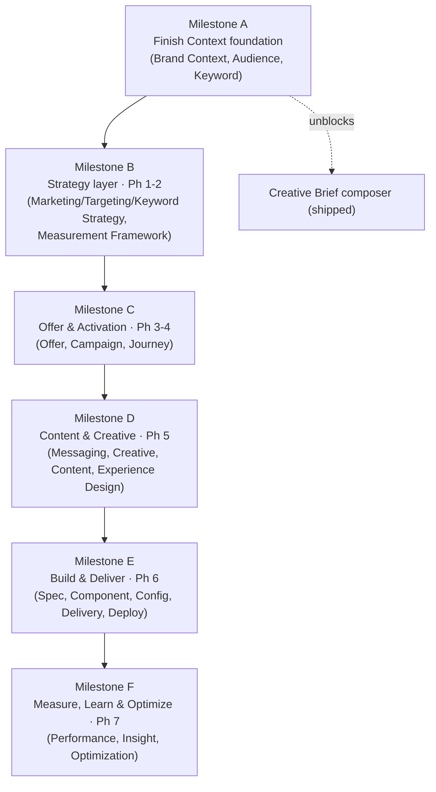

# OSMM™ Roadmap

The sequenced plan for building OSMM out from its current state (11 of 27 object
builders, 1 composer) to a complete, connected model. For live status see
[`BACKLOG.md`](BACKLOG.md).

**Last updated:** 2026-06-11

## Guiding principles

The build order follows three rules, in priority order:

1. **Context before Work Product.** Context objects are high-read and referenced
   by everything downstream; Work Products and composers are nearly useless
   without them. Finish the Context layer first.
2. **Unblock what's already shipped.** The Creative Brief composer already ships
   but lists `brand_context` as a *required* input — so Brand Context is the
   single highest-priority builder.
3. **Walk the phases in order after that.** Phases 1→7 are a dependency chain
   (strategy → audience → offer → campaign → creative → build → measure), so
   building in phase order keeps every new builder's references resolvable.

Each builder is a self-contained PR (one object, per `CONTRIBUTING.md`), shipped
at `status: draft`, ideally with one public-sourced example instance.

## The milestones

### Milestone A — Finish the Context foundation ✅ COMPLETE
**Objects:** ~~Brand Context (B02)~~ ✅, ~~Audience (B06)~~ ✅, ~~Keyword (B08)~~ ✅
(plus ~~Product Context (B35)~~ ✅, added out of band).
**Why first:** Context is the foundation the whole model references. With Keyword
shipped, **all six Context objects now have builders** — the Creative Brief composer
runs end-to-end on the Wendy's set, the Persona ↔ Audience and Keyword → Persona
edges are realized, and Keyword unblocks Keyword Strategy (B09) in Milestone B.
**Exit state (met):** Business, Brand, Product, Audience, Persona, and Keyword all
have builders.
**Composer unlocked:** Brand Playbook (C04).

### Milestone B — Strategy layer (Phase 1–2 Work Products)
**Objects:** ~~Marketing Strategy (B03)~~ ✅, ~~Measurement Framework (B04)~~ ✅,
Keyword Strategy (B09).
**Why next:** these are the first Work Products and they reference the Context
layer from Milestone A. **Marketing Strategy (B03) and Measurement Framework (B04)
shipped early** — the MKS ↔ MEF edge is realized, so the Strategy Brief composer
(C03) is fully sourced. **Targeting Strategy folded into Marketing Strategy** in the
v0.5 right-sizing, so only Keyword Strategy (B09) remains — and it must clear the
"earns its own object" bar at build time.
**Composers unlocked:** Strategy Brief (C03), Audience Strategy (C05).

### Milestone C — Offer & Activation (Phase 3–4)
**Objects:** ~~Offer (B11)~~ ✅, ~~Campaign Strategy (B13)~~ ✅, ~~Journey Strategy (B14)~~ ✅,
Experiment Strategy (B36, cross-phase).
**Why:** turns strategy into activatable plans. **Offer, Campaign Strategy, and Journey
Strategy shipped** — realizing the Phase 3–4 activation edges (Campaign → Marketing/
Journey/Audience/Offer; Offer → Product Context). Only **Experiment Strategy (B36)**
remains, and should clear the "earns its own object" bar at build time. *Right-sized:
Offer Strategy folded into Offer; Offer/Creative Test Strategy → Experiment Strategy;
Campaign Measurement → Measurement Framework.*
**Composers unlocked:** Campaign Brief (C02), Journey Map (C06).

### Milestone D — Content & Creative (Phase 5)
**Objects:** Messaging Framework (B16), Creative Strategy (B17), Content Strategy
(B18), Experience Design (B19).
**Why:** completes the inputs to the Creative Brief composer's *optional* tier,
making that artifact fully-sourced rather than synthesized-and-flagged. *Right-sized:
Creative Test Strategy folded into Experiment Strategy; Content Strategy / Experience
Design may fold into Creative Strategy at build time.*

### Milestone E — Build & Deliver (Phase 6)
**Objects:** Experience Specification (B21), Experience Component (B22), Journey
Configuration (B23), Personalization Configuration (B24), Experience Delivery
(B25), Experience Validation (B26), Campaign Deployment (B27).
**Why:** the operational layer — specs, components, configuration, delivery, QA,
deployment. *Right-sized: Experience Performance folded into Performance Measurement
(`dimension: experience`). Experience Validation may become a state on Delivery, and
Personalization Configuration may merge with Journey Configuration — decided at build
time.*

### Milestone F — Measure, Learn & Optimize (Phase 7)
**Objects:** Performance Measurement (B29), Customer Insight (B30), Optimization
Recommendation (B34).
**Why last:** the Learning objects close the loop — they reference what they
evaluate and *propose updates back into Context* (sub-process 7.7). They are most
valuable once there's a full pipeline producing things to measure. *Right-sized: the
per-dimension Offer/Creative/Journey Performance objects folded into Performance
Measurement via a `dimension` facet.*
**Composer unlocked:** Optimization Plan (C07).

## Parallel tracks (run alongside the milestones)

- **Examples (I09):** ship one public-sourced instance per builder as it lands.
- **Validators (I10):** schemas already ship standalone at
  `schemas/<object_type>.schema.json` and CI validates examples; add
  `osmm-<object>-validator` skill-layer wrappers as needed, starting with the
  most-referenced objects.
- **Id-prefix ratification (I11)** and **reference-edge tracking (I13):** confirm
  each object's prefix and record its reference fields in `RELATIONSHIPS.md` as
  its builder ships.
- **Vocabulary expansion (I12):** extend governed enums as real inputs demand.

## Sizing snapshot

| Milestone | Builders | Cumulative builders done |
|-----------|---------:|-------------------------:|
| (shipped) | 11 | 11 / 27 |
| A ✅ complete (Brand, Audience, Keyword, Product Context all done) | 0 | 11 / 27 |
| B (Keyword Strategy; Targeting folded into Marketing Strategy) | 1 | 12 / 27 |
| C (Offer + Campaign + Journey shipped; Experiment Strategy remains) | 1 | 13 / 27 |
| D | 4 | 17 / 27 |
| E | 7 | 24 / 27 |
| F | 3 | 27 / 27 |

Composers and infrastructure are additive on top of the builder count.

## A note on scope discipline

Per the `lean over over-engineered` tenet ([GOVERNANCE.md](../GOVERNANCE.md)):
composers (C-track) are **non-normative accelerators** — build the few that earn
their keep, not all seven. The 27 builders are the standard; the composers are
convenience.
