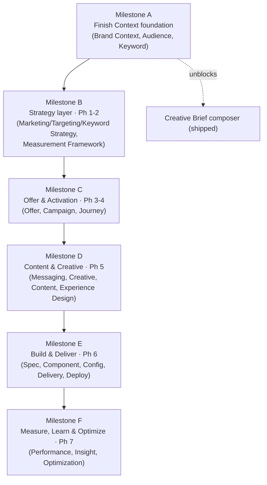

# OSMM™ Roadmap

The sequenced plan for building OSMM out from its current state (5 of 34 object
builders, 1 composer) to a complete, connected model. For live status see
[`BACKLOG.md`](BACKLOG.md).

**Last updated:** 2026-06-08

## Guiding principles

The build order follows three rules, in priority order:

1. **Context before Work Product.** Context objects are high-read and referenced
   by everything downstream; Work Products and composers are nearly useless
   without them. Finish the Context layer first.
2. **Unblock what's already shipped.** The Creative Brief composer already ships
   but lists `brand_context` as a *required* input — so Brand Context is the
   single highest-priority builder.
3. **Walk the phases in order after that.** Phases 1→7 are a dependency chain
   (strategy → audience → offer → campaign → creative → build → measure), so
   building in phase order keeps every new builder's references resolvable.

Each builder is a self-contained PR (one object, per `CONTRIBUTING.md`), shipped
at `status: draft`, ideally with one public-sourced example instance.

## The milestones

### Milestone A — Finish the Context foundation
**Objects:** ~~Brand Context (B02)~~ ✅, ~~Audience (B06)~~ ✅, Keyword (B08).
**Why first:** Context is the foundation the whole model references. Brand Context
(the missing *required* composer input) and Audience (OSMM's addressable segment)
are **now shipped** — the composer runs end-to-end on the Wendy's set, and the
Persona ↔ Audience edge is realized. Only **Keyword (B08)** remains to complete
the durable Context layer.
**Exit state:** all five Context objects (Business, Brand, Audience, Persona,
Keyword) have builders; the Creative Brief composer can run on fully-real inputs.
**Composer unlocked:** Brand Playbook (C04).

### Milestone B — Strategy layer (Phase 1–2 Work Products)
**Objects:** ~~Marketing Strategy (B03)~~ ✅, Measurement Framework (B04), Targeting
Strategy (B05), Keyword Strategy (B09).
**Why next:** these are the first Work Products and they reference the Context
layer from Milestone A. **Marketing Strategy (B03) shipped early** — it's referenced
by most later objects, and its `linked_measurement_framework` placeholder makes
Measurement Framework (B04) the natural next pick.
**Composers unlocked:** Strategy Brief (C03), Audience Strategy (C05).

### Milestone C — Offer & Activation (Phase 3–4)
**Objects:** Offer Strategy (B10), Offer (B11), Offer Test Strategy (B12),
Campaign Strategy (B13), Journey Strategy (B14), Campaign Measurement (B15).
**Why:** turns strategy into activatable plans. Campaign and Journey Strategy are
high-value, frequently-referenced objects.
**Composers unlocked:** Campaign Brief (C02), Journey Map (C06).

### Milestone D — Content & Creative (Phase 5)
**Objects:** Messaging Framework (B16), Creative Strategy (B17), Content Strategy
(B18), Experience Design (B19), Creative Test Strategy (B20).
**Why:** completes the inputs to the Creative Brief composer's *optional* tier,
making that artifact fully-sourced rather than synthesized-and-flagged.

### Milestone E — Build & Deliver (Phase 6)
**Objects:** Experience Specification (B21), Experience Component (B22), Journey
Configuration (B23), Personalization Configuration (B24), Experience Delivery
(B25), Experience Validation (B26), Campaign Deployment (B27), Experience
Performance (B28).
**Why:** the operational layer — specs, components, configuration, delivery, QA,
deployment. Largest milestone (8 objects); includes the two Configuration-category
objects.

### Milestone F — Measure, Learn & Optimize (Phase 7)
**Objects:** Performance Measurement (B29), Customer Insight (B30), Offer
Performance (B31), Creative Performance (B32), Journey Performance (B33),
Optimization Recommendation (B34).
**Why last:** the Learning objects close the loop — they reference what they
evaluate and *propose updates back into Context* (sub-process 7.7). They are most
valuable once there's a full pipeline producing things to measure.
**Composer unlocked:** Optimization Plan (C07).

## Parallel tracks (run alongside the milestones)

- **Examples (I09):** ship one public-sourced instance per builder as it lands.
- **Validators + schema promotion (I10):** when a second tool needs an object's
  schema, add `osmm-<object>-validator` and promote the schema to
  `schemas/<object_type>.schema.json`. Begin with the most-referenced objects.
- **Id-prefix ratification (I11)** and **reference-edge tracking (I13):** confirm
  each object's prefix and record its reference fields in `RELATIONSHIPS.md` as
  its builder ships.
- **Vocabulary expansion (I12):** extend governed enums as real inputs demand.

## Sizing snapshot

| Milestone | Builders | Cumulative builders done |
|-----------|---------:|-------------------------:|
| (shipped) | 5 | 5 / 34 |
| A (Keyword remains; Brand Context + Audience done) | 1 | 6 / 34 |
| B (Marketing Strategy done early; 3 remain) | 3 | 9 / 34 |
| C | 6 | 15 / 34 |
| D | 5 | 20 / 34 |
| E | 8 | 28 / 34 |
| F | 6 | 34 / 34 |

Composers and infrastructure are additive on top of the builder count.

## A note on scope discipline

Per the `lean over over-engineered` tenet ([GOVERNANCE.md](../GOVERNANCE.md)):
composers (C-track) are **non-normative accelerators** — build the few that earn
their keep, not all seven. The 34 builders are the standard; the composers are
convenience.
